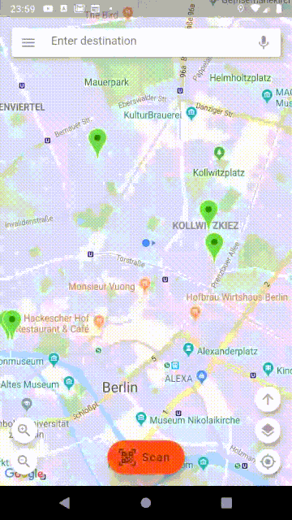

# Circ Flutter Challenge

Challenge app to be hired at Circ.

## Getting Started

- [Lab: Write your first Flutter app](https://flutter.dev/docs/get-started/codelab)
- [Cookbook: Useful Flutter samples](https://flutter.dev/docs/cookbook)

## Requirements
* Application should open map after start. 
* Google Maps Flutter plugin should be used. 
* Information about vehicles should be retrieved from /vehicles endpoint. 
* No authentication is needed. 
* Vehicles should be presented as pins on map on retrieved locations. 
* On vehicle selection, new card should popup with more detailed information about selected vehicles. 
* On vehicle deselection, application should hide the card. 
* On other vehicle selection, card should display info about newly selected vehicle. 

#### Notes
* Code needs to be well organised, testable and written in Dart. 
* Please create a publicly available Git repository with your solution. 
* As we are all trying to build bullet proof solutions, unit tests are mandatory.

## To get this up and running

* Google maps API keys are not provided inside this repository. They have to be inserted into Gradle.
* Integration tests: Due to limitations in Flutter framework the permissions need to be granted on test startup.
* Integration tests can be started with this command: **`flutter drive --target=test_driver/app.dart`**

## Technical details
* UI and business logic are decoupled by using the BLoC pattern.
* Targeting Android API level >= 16

Libraries

## Additionally implemented features

#### Platform specific launcher icons
   

#### QR code scanner

Scan any of these QR codes to simulate scanning a scooter (vehicles 1-6):

                  

<i>Camera is not working in iOS simulator as the simulator has no camera support.</i>

#### Custom swipe to confirm button

#### Map types

#### User manual

#### Some more screenshots

