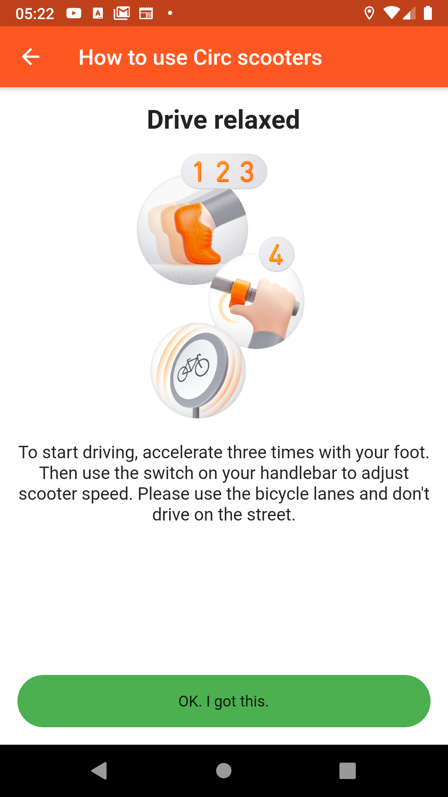
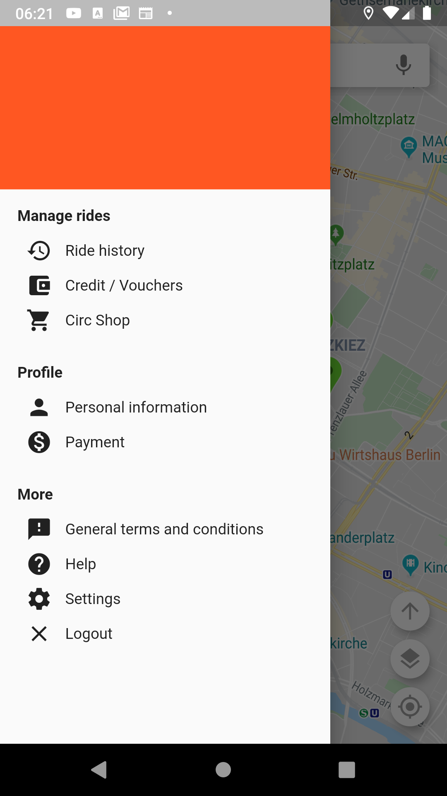

# Circ Flutter Challenge

## To get this up and running
* Google maps API keys are not provided inside this repository. They have to be inserted into Gradle.
* Integration tests: Due to limitations in Flutter framework the permissions need to be granted on test startup.
* Integration tests can be started with **`flutter drive --target=test_driver/app.dart`** from the project directory.

## Technical details
* UI and business logic are decoupled by using the BLoC pattern.
* Developed and tested with Flutter dev channel (1.10.14)
* Targeting Android API level >= 16

## Additionally implemented features

#### Platform specific launcher icons
   

<i>iOS left, Android right</i>

#### QR code scanner

Scanning a QR code opens the info popup to unlock the vehicle:

    

Scan any of these QR codes to simulate scanning a scooter (vehicles 1-6):

                  

<i>Camera is not working in iOS <b>simulator</b> as the simulator has no camera support.</i>

#### Custom swipe to confirm button
* At first I made on myself based on Draggable and DragDestination. This did not bring the desired result since the horizontal movement could not be constrained and teh draggable could be dragged outside of the slider borders.
* Then I tried two libraries and was not satisfied with them. So I made my own.
* I will publish this custom drag-to-confirm widget soon as package (after some adjustments and cleanups). 

#### Map types / details
   

#### User manual
         

#### Some more screenshots
  

## Open problems:
* Animations for overlay buttons when vehicle info popup opens (are currently hidden)
* A click on a marker does not center the map (this was intentional, since this could be confusing). But the map should be centered if the marker would be hidden by the info popup.
* Unfocus search bar when map is tapped
* More integration and unit tests (especially for MapsBloc)
* Startup delay: app should start much faster.
* Integration test: Permissions need to be granted on each test startup by hand (seems to be a Flutter Driver limitation)

## Possible roadmap:
* Theme for colors, font sizes, styles etc.
* Swipe indicator for tutorial
* Startup/loading screen
* Persistence: i.e. last position, no need to have a random start position for camera movement like LatLng(0,0)
* Navigation / PlacesAPI
* There are some things about the Maps plugin that are difficult to handle. Traffic layer for example does not repaint if it has not been set on creation time, even when in StreamBuilder.
* Add business logic to lock/unlock (with running timer in the background) which results in a ride history.